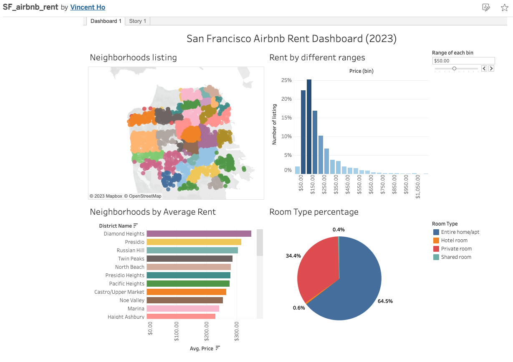

# SanFrancisco_airbnb_rent

https://public.tableau.com/app/profile/vincent.ho4408/viz/SF_airbnb_rent/Dashboard1

## Author

-   Vincent Ho

## Background

Rent is one of the biggest expenses if you do not own a house, whether you are a marketing professional or simply a renter. Understanding the rental situation in a particular area can offer us valuable insights. The target of this project is San Francisco, which is renowned for having some of the highest rents not only in the United States but also in the world. This project will focus on the rent of a single room instead of the whole house.

## Goal

Exploring the following ideas:

- What are the highest and lowest rent neighborhoods in San Francisco?
- What is the price range in different neighborhoods?

## Data

The [original data](https://github.com/vincentho32/SanFrancisco_airbnb_rent/blob/main/data/original/listings.csv) is found on
[Inside Airbnb](http://insideairbnb.com/get-the-data/)
All rights belong to the respective owner.

The [preprocessed data](https://github.com/vincentho32/SanFrancisco_airbnb_rent/blob/main/data/processed/sf_airbnb_rent.csv) is combined by myself. Please see this [preprocessed notebook](https://github.com/vincentho32/SanFrancisco_airbnb_rent/blob/main/SF_airbnb_preprocess.ipynb) for details.

## Result

The [findings](https://public.tableau.com/app/profile/vincent.ho4408/viz/SF_airbnb_rent/Dashboard1) can be found under the "Story" tab of this Tableau dashboard.

## Acknowledgements

Inside Airbnb
